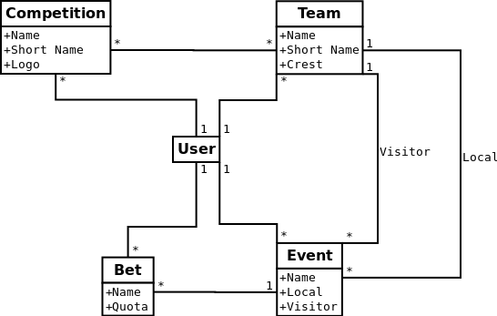

# Sports Betting

Aplicació web de simulació d'apostes esportives on els usuaris poden crear els seus propis equips, competicions, events...

L' Aplicació permet:

* Crear/editar/eliminar competicions.
* Crear/editar/eliminar equips.
* Crear/editar events formats per 2 equips.
* Crear/editar/eliminar apostes sobre un event.

## Final models



Mirar models.png

### Prerequisites

```
requests
Django==1.10.6
Pillow==4.0.0
behave==1.2.5
splinter==0.7.5
gunicorn==19.7.1
whitenoise==3.3.0
dj-database-url==0.4.2
psycopg2==2.7.1
djangorestframework==3.6.2
djangorestframework-xml==1.3.0

```

## Running the tests

Els testos s'han realitzat amb la llibreria behave.
Path als testos: sportsBetting/features.
S'ha instalat l'aplicació [behave_django](https://github.com/behave/behave-django) per integrar els testos behave a django.

### Run tests

Comanda per executar els testos behave.

```
python manage.py test sportsBetting
```

## API

S'ha utilitzat l'api de [football-data](http://www.football-data.org/)

## Admin User

Username: admin
Password: 1234

## Authors

* **Marcel Porta** - [Marcelpv96](https://github.com/Marcelpv96)
* **Guillem Orellana** - [Guillem96](https://github.com/Guillem96)
* **Albert Perez** - [Albert](https://github.com/albeertito7)
